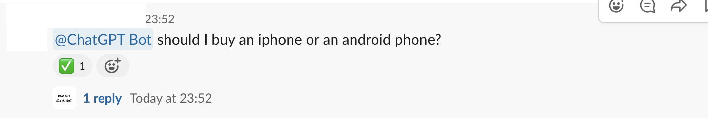
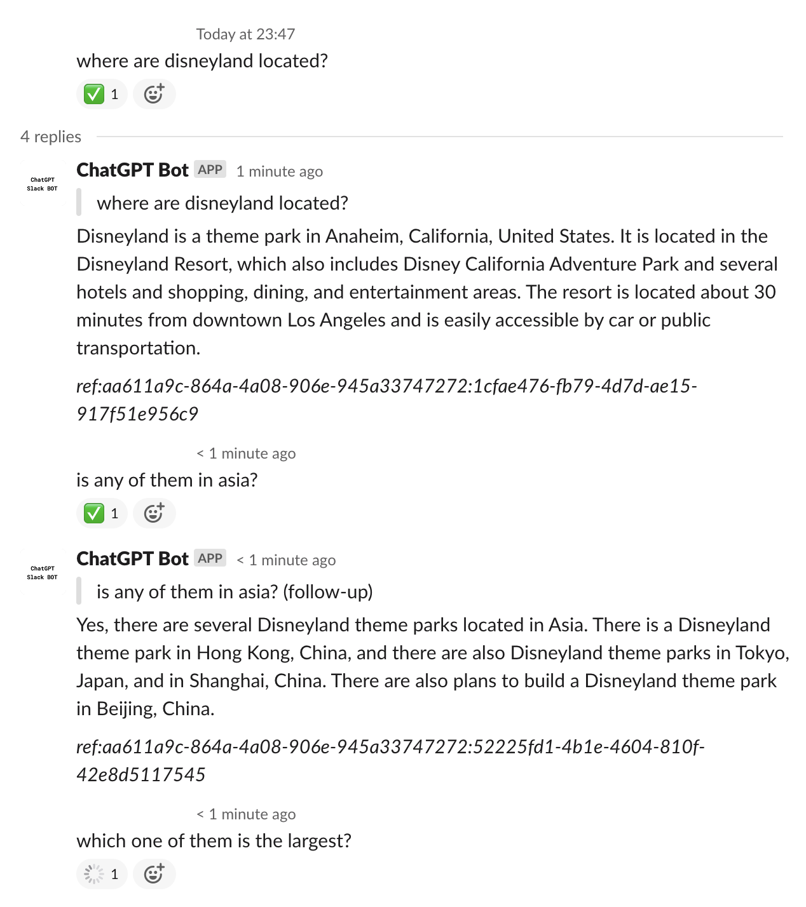

# ChatGPT Slack Bot

This Slack Bot is implemented in Node.js, under the hood it depends on [transitive-bullshit/chatgpt-api](https://github.com/transitive-bullshit/chatgpt-api), which uses puppeteer browser as solution to connect with ChatGPT.

This service is ***docker containerized*** and can be deployed onto servers with headless chromium browser without an active display. _(Suggested to use google login in order to bypass recaptcha)_

It also incorporates ***queue mechanism*** with redis, so that it is more flexible to handle request spikes, make sure the requests are sent one by one and in order to protect from being rate limited by ChatGPT.

## Start Modes
This app has two modes to start:
1. `slackbot` - listens to slack event for user requests, put request to redis as queue
2. `chatgpt` - serves as queue worker that listens to queue, forward user's questions to chatgpt, and write to slack on answer.

## Setup

### Slack Setup
1. Register an Slack App in [portal](https://api.slack.com/apps)
2. Enable Socket Mode
3. Grant these permissions: `app_mentions:read`, `channels:history`, `chat:write`, `im:history`, `im:write`, `reactions:write`, `groups:history`

### Build and run with docker
```
docker build -t chatgpt_slackbot .
docker run chatgpt_slackbot
```

### Environment Variables
|Key|required|description|
|--|--|--|
|`START_MODE`|Y|`slackbot` or `chatgpt`
|`SLACK_BOT_TOKEN`|Y|Your Slack Bot token. See https://api.slack.com/|
|`SLACK_APP_TOKEN`|Y|Your Slack App token. See https://api.slack.com/|
|`SLACK_BOT_USER_ID`|Y|The User ID of your Slack Bot. See https://api.slack.com/|
|`CHATGPT_EMAIL`|Y|The email of your chatgpt account|
|`CHATGPT_PASSWORD`|Y|The password of your chatgpt account|
|`CHATGPT_PROXY_SERVER`|N|e.g.: 12.123.234.345:23456, leave it blank if not used|
|`CHATGPT_IS_GOOGLE_LOGIN`|N|1 or 0, default 0|
|`CHATGPT_REQUEST_TIMEOUT_MS`|N|Timeout value for chatgpt request. default 300000 (5min)|
|`QUEUE_INTERVAL_MS`|N|Interval between handling each queue item in ms. default 3000|

## Usage
- The slackbot will listen to two types of event in slack workspace
  - Directly message the bot in slack.
  - Mention your bot in a channel with a question. For example: `@ChatGPT BOT` who is Donald trump?
- To ask follow up question, reply in the answer thread, otherwise it will treat it as a new question.

### Mention in Channel


### Direct Message


