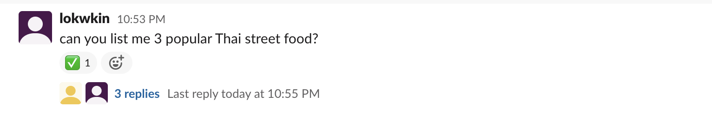

# ChatGPT Slack Bot

This Slack Bot is implemented in Node.js, under the hood it depends on [transitive-bullshit/chatgpt-api](https://github.com/transitive-bullshit/chatgpt-api), which is a package to help integrating with ChatGPT API.

This service is ***docker containerized*** , and has incorporates ***queue mechanism*** with redis, so that it is more flexible to handle request spikes, make sure the requests are sent one by one and in order to protect from being rate limited by ChatGPT API. 

(Since it is a queue-worker mechanism, you may deploy more workers (under different OpenAI accounts) to listen to a same queue if you starts to being rate limited by OpenAI. This service is smart enough to redirect the follow-up questions to the worker that handles the previous question.)

## Usage
- The slackbot will listen to two types of event in slack workspace
  - Directly message the bot in slack.
  - Mention your bot in a channel with a question. For example: `@ChatGPT BOT` who is Donald trump?
- To ask follow up question, reply in the answer thread, otherwise it will treat it as a new question.

### Mention in Channel


### Direct Message



## Start Modes
This app has two modes to start:
1. `slackbot` - listens to slack event for user requests, put request to redis queue, reply to slack on answer received.
2. `chatgpt` - serves as queue worker that listens to queue, forward user's questions to chatgpt, and put response back to queue on answer received.

## Setup

### Slack Setup
1. Register an Slack App in [portal](https://api.slack.com/apps)
2. "Socket Mode" -> Enable Socket Mode
3. "OAuth & Permissions" -> Grant these permissions: `app_mentions:read`, `channels:history`, `chat:write`, `im:history`, `im:write`, `reactions:write`, `groups:history`
4. "Event Subscription" -> "Subscribe to bot events" -> Add `message.im` and `app_mention`
5. "App Home" -> "Message Tab" -> Check "Allow users to send Slash commands and messages from the messages tab"
6. Obtain your Bot Token from "OAuth & Permissions" > "Bot User OAuth Token"
7. Obtain your App Token from "Basic Information" > "App Level Token"
8. "Install App" -> Reinstall to workspace if neccessary


### Build and run with docker
```
docker build -t chatgpt_slackbot .
docker run chatgpt_slackbot
```

### Environment Variables
#### START_MODE=slackbot
|Key|required|description|
|--|--|--|
|`START_MODE`|Y|`slackbot`|
|`REDIS_URL`|Y|Redis connection url, e.g.: `redis://127.0.0.1.6379`|
|`SLACK_BOT_TOKEN`|Y|Your Slack Bot token. See https://api.slack.com/|
|`SLACK_APP_TOKEN`|Y|Your Slack App token. See https://api.slack.com/|
|`SLACK_BOT_USER_ID`|Y|The User ID of your Slack Bot. See https://api.slack.com/|
|`SLACK_REACTION_LOADING`|N|The emoji to react when loading a question, default `thinking_face`
|`SLACK_REACTION_SUCCESS`|N|The emoji to react when the prompt is answered, default `white_trade_mark`
|`SLACK_REACTION_FAILED`|N|The emoji to react when failed when processing, default `x`
|`CHATGPT_RESPONSE_QUEUE_NAME`|N|Queue name to use for listening for ChatGPT answers, default `queues.answers.slackbot`

#### START_MODE=chatgpt
|Key|required|description|
|--|--|--|
|`START_MODE`|Y|`chatgpt`|
|`REDIS_URL`|Y|Redis connection url, e.g.: `redis://127.0.0.1.6379`|
|`OPENAI_API_KEY`|Y|API Key of your OpenAI Account|
|`CHATGPT_REQUEST_TIMEOUT_MS`|N|Timeout value for chatgpt request. default 300000 (5min)|
|`CHATGPT_PARAM_TEMPERATURE`|N|ChatGPT Param `temperature`, default 0.5|
|`CHATGPT_PARAM_TOP_P`|N|ChatGPT Param `top_p`, default 0.8|
|`CHATGPT_PARAM_PRESENSE_PENALTY`|N|ChatGPT Param `presense_penalty`, default 0.3|
|`CHATGPT_PARAM_FREQUENCY_PENALTY`|N|ChatGPT Param `frequency_penalty`, default 0.5|
